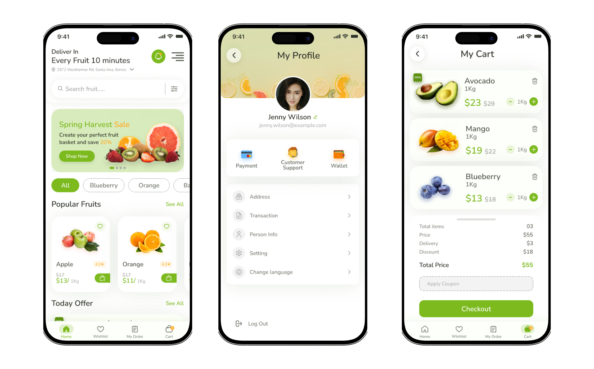

# Fresh Fruits - Local Fruit Ordering App Built with React Nativ


# Getting Started

A simple and efficient mobile app that allows customers to order fresh fruits directly from nearby small shops. Users can browse seasonal produce, place quick orders, and choose delivery or in-store pickup. Developed using React Native with a Node.js (Express) backend and MongoDB, the app empowers local vendors with digital convenience.

# Installation
## Step 1: Start the Metro Server

First, you will need to start **Metro**, the JavaScript _bundler_ that ships _with_ React Native.
To start Metro, run the following command from the _root_ of your React Native project:

```bash
# using npm
npm start

# OR using Yarn
yarn start
```

## Step 2: Start your Application

Let Metro Bundler run in its _own_ terminal. Open a _new_ terminal from the _root_ of your React Native project. Run the following command to start your _Android_ or _iOS_ app:

### For Android

```bash
# using npm
npm run android

# OR using Yarn
yarn android
```

### For iOS

```bash
# using npm
npm run ios

# OR using Yarn
yarn ios
```

If everything is set up _correctly_, you should see your new app running in your _Android Emulator_ or _iOS Simulator_ shortly provided you have set up your emulator/simulator correctly.
This is one way to run your app — you can also run it directly from within Android Studio and Xcode respectively.

# Features
- Splash screen
- OTP login
- Notification
- Live location for delivery
- Wallet
- Online payment
- Product filtering
- Search functionality
- Top items highlight
- Account settings

Powered by [Websadroit](https://websadroit.com)
